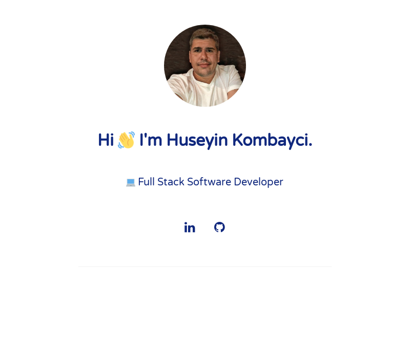

## [huseyinkombayci.com](https://huseyinkombayci.com)

Personal website of Huseyin Kombayci

## Setup

1. Run `bundle install`
2. Run `bundle exec jekyll serve --config _config.yml,_config-dev.yml`
3. Open it in your browser: `http://localhost:4000`

## License

MIT © [Huseyin Kombayci](https://huseyinkombayci.com)